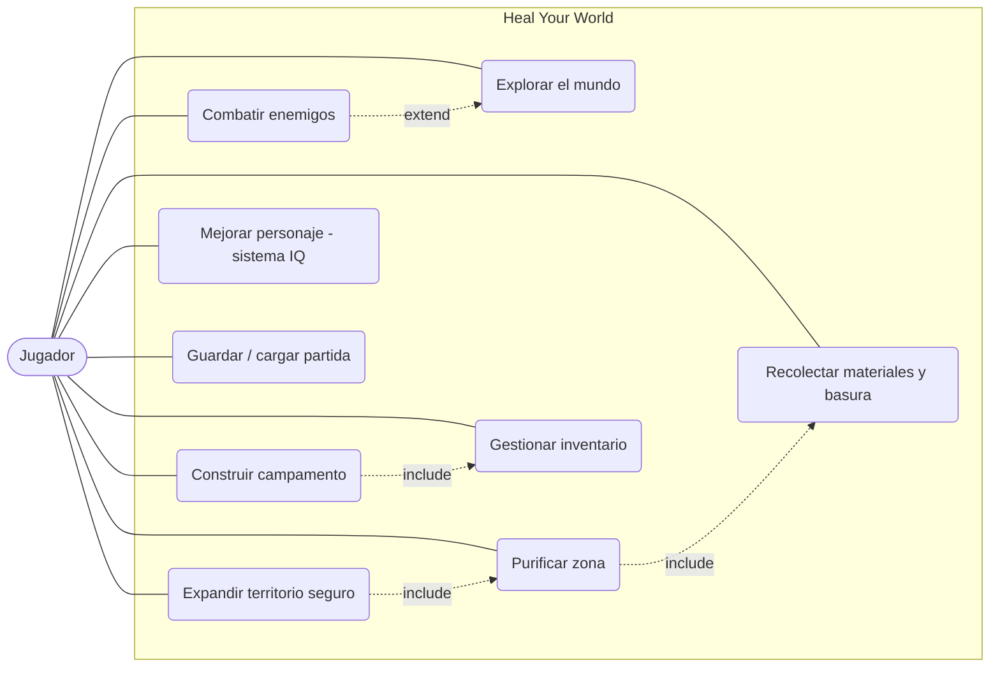

# Diagrama de casos de uso general

Muestra las acciones que el jugador puede realizar en Heal Your World.

```mermaid
flowchart LR
    J([Jugador])

    subgraph Sistema["Heal Your World"]
        UC1(Explorar el mundo)
        UC2(Combatir enemigos)
        UC3(Recolectar materiales y basura)
        UC4(Construir campamento)
        UC5(Purificar zona)
        UC6(Expandir territorio seguro)
        UC7(Gestionar inventario)
        UC8(Mejorar personaje - sistema IQ)
        UC9(Guardar / cargar partida)
    end

    J --- UC1
    J --- UC2
    J --- UC3
    J --- UC4
    J --- UC5
    J --- UC6
    J --- UC7
    J --- UC8
    J --- UC9

    UC5 -. include .-> UC3
    UC4 -. include .-> UC7
    UC6 -. include .-> UC5
    UC2 -. extend .-> UC1
```
