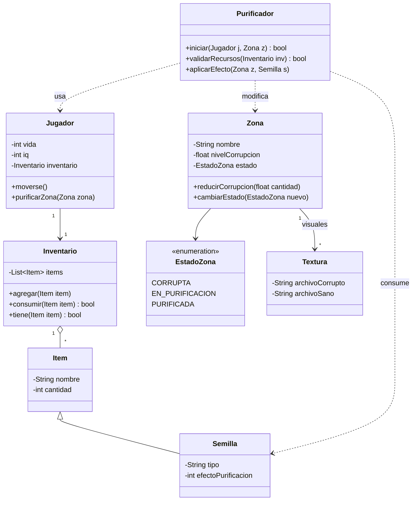

# Diagrama de clases: módulo Purificación

Muestra las clases que intervienen cuando el jugador purifica una zona corrupta.

```mermaid
classDiagram
    class Jugador {
        -int vida
        -int iq
        -Inventario inventario
        +moverse()
        +purificarZona(Zona zona)
    }

    class Inventario {
        -List~Item~ items
        +agregar(Item item)
        +consumir(Item item) bool
        +tiene(Item item) bool
    }

    class Item {
        -String nombre
        -int cantidad
    }

    class Semilla {
        -String tipo
        -int efectoPurificacion
    }

    class Zona {
        -String nombre
        -float nivelCorrupcion
        -EstadoZona estado
        +reducirCorrupcion(float cantidad)
        +cambiarEstado(EstadoZona nuevo)
    }

    class EstadoZona {
        <<enumeration>>
        CORRUPTA
        EN_PURIFICACION
        PURIFICADA
    }

    class Textura {
        -String archivoCorrupto
        -String archivoSano
    }

    class Purificador {
        +iniciar(Jugador j, Zona z) bool
        +validarRecursos(Inventario inv) bool
        +aplicarEfecto(Zona z, Semilla s)
    }

    Jugador "1" --> "1" Inventario
    Inventario "1" o-- "*" Item
    Item <|-- Semilla
    Purificador ..> Jugador : usa
    Purificador ..> Zona : modifica
    Purificador ..> Semilla : consume
    Zona --> EstadoZona
    Zona "1" --> "*" Textura : visuales
```
